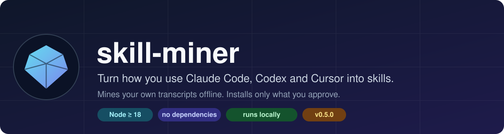
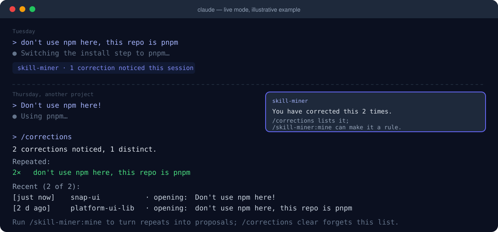
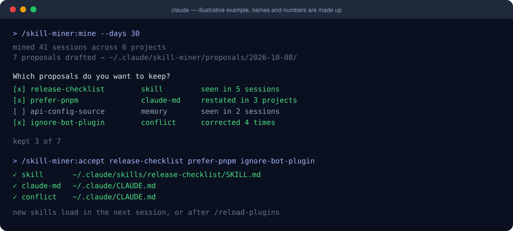
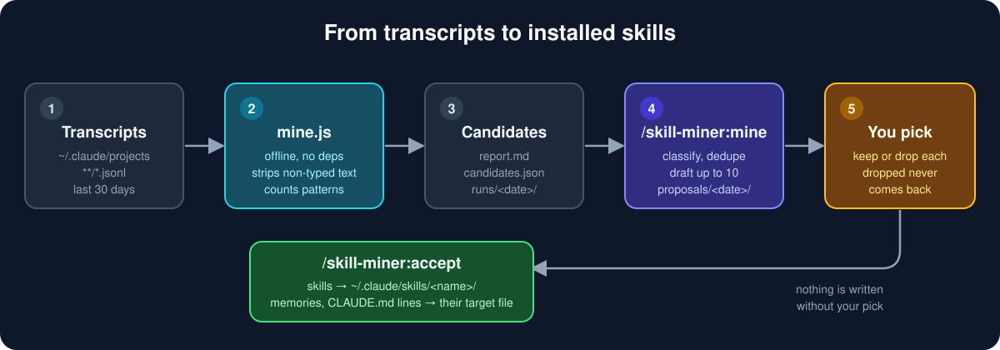
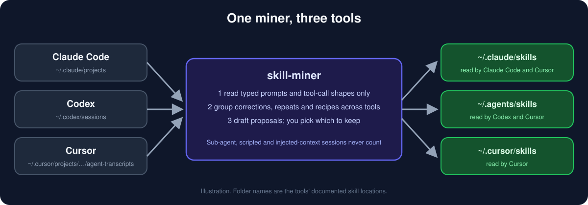
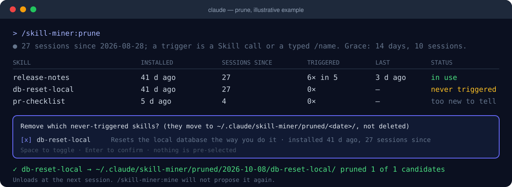
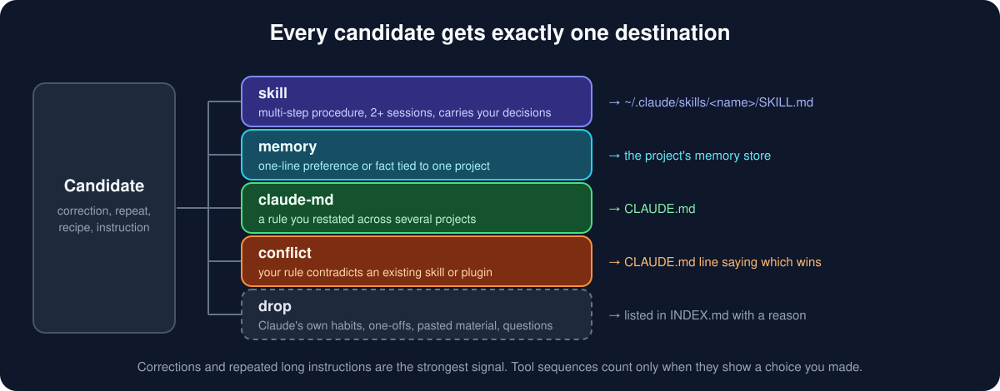
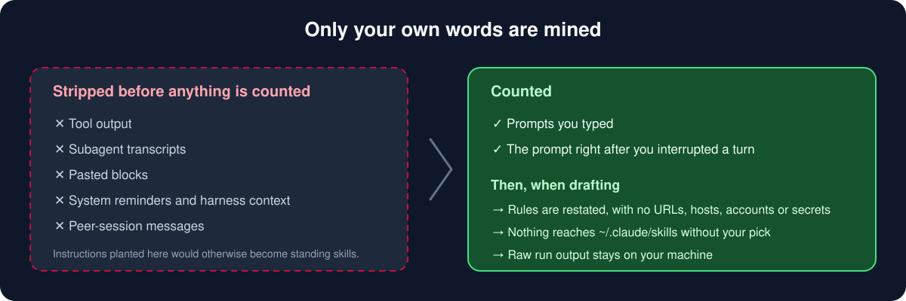

<p align="center">
  
</p>

<p align="center">
  <a href="https://github.com/zdanovichnick/skill-miner/releases/tag/v0.5.0"></a>
  
  
  <a href="LICENSE"></a>
</p>

**skill-miner** reads your own Claude Code, Codex and Cursor transcripts, finds what you keep correcting and keep
repeating, and proposes skills and memories for it. You review every proposal. Nothing is
installed that you didn't pick.

It also runs **live**: a hooks module watches what you type, counts corrections on the status
line, and raises a toast the second time you correct the same thing, in any project, on any day.
`/corrections` shows the list; `/skill-miner:mine --live` proposes a rule for the repeats right
then, without waiting for the next full mining run.

<p align="center">
  
</p>

> Illustration. Names and numbers are made up.

## Install

**Claude Code**

```
/plugin marketplace add zdanovichnick/skill-miner
/plugin install skill-miner@skill-miner-marketplace
```

**Codex and Cursor** need no plugin system, only Node ≥ 18:

```
git clone https://github.com/zdanovichnick/skill-miner
node skill-miner/scripts/install.js self --target agents
```

That puts the miner and its scripts in `~/.agents/skills/skill-miner`, which both tools read. Then ask
Codex for `$skill-miner` or Cursor for `/skill-miner`, and say what to do: mine, accept a proposal,
or prune. (`--target cursor` or `--target claude` installs it elsewhere; `--replace` updates it.)

## Use

| Command | What it does |
|---|---|
| `/skill-miner:mine [--days 30] [--min-sessions 3]` | Mines Claude Code, Codex and Cursor transcripts (`--source` picks which), drafts up to 10 proposals under `~/.claude/skill-miner/proposals/<date>/`, asks which to keep |
| `/skill-miner:mine --live` | Skips the transcript scan and proposes rules for the live mod's repeats alone — the quick pass after a toast |
| `/skill-miner:accept <name>...` | Installs kept proposals: skills into `~/.claude/skills/<name>/`, memories and CLAUDE.md lines into their target file |
| `/corrections [clear]` | Lists the corrections the live mod noticed as you typed them, repeats first; `clear` forgets them |
| `/skill-miner:prune [--grace-days 14] [--grace-sessions 10]` | Finds generated skills never invoked since install and moves the ones you pick to `~/.claude/skill-miner/pruned/<date>/` |

<p align="center">
  
</p>

> The session above is an illustration. Names and numbers are made up.

## How it works

<p align="center">
  
</p>

`scripts/mine.js` (Node ≥ 18, no dependencies) reads the transcripts offline and writes
`~/.claude/skill-miner/runs/<date>/report.md` and `candidates.json`:

- **Corrections**: prompts that open with or contain a correction ("don't use…", "instead of…",
  "I said…"), plus the prompt you typed right after interrupting a turn.
- **Repeated long instructions**: the same 160+ character instruction typed in 2+ sessions.
- **Tool sequences and shell recipes**: 3–5 tool n-grams and build/deploy commands seen in 3+
  sessions, with the edit→build→test loop every session has filtered out.
- **Prompt openings, slash-command use**, and up to 80 recent long instructions that the
  command clusters by intent.

### Codex and Cursor

The same miner reads Codex and Cursor transcripts, and the skills it drafts use the portable
[Agent Skills](https://agentskills.io) format (`SKILL.md` with only `name` and `description`), so
one proposal installs into whichever tool will load it.

<p align="center">
  
</p>

| | Claude Code | Codex | Cursor |
|---|---|---|---|
| Transcripts | `~/.claude/projects/**/*.jsonl` | `sessions/` and `archived_sessions/` under `$CODEX_HOME` or `~/.codex` | `~/.cursor/projects/<project>/agent-transcripts/<id>/<id>.jsonl` |
| What counts as typed | user messages | `user_message` events; injected user-role context does not | the text inside `<user_query>`; attached-context blocks do not |
| Left out | sub-agents, task notifications | sub-agent and scripted (`exec`) runs | blocks without `<user_query>` |
| Timestamps | yes | yes | no, so sessions are dated by file modification time |
| Tool calls | names and inputs | shell, patches, MCP | names and inputs, no output |
| Skills folder | `~/.claude/skills` | `~/.agents/skills` | `~/.agents/skills`, `~/.cursor/skills`, and it reads `~/.claude/skills` too |
| Run it | `/skill-miner:mine` | `$skill-miner` | `/skill-miner` |
| Live | hooks module, toast, `/corrections` | `UserPromptSubmit` hook, one-line notice | `beforeSubmitPrompt` hook, recorded without a notice |

`--source auto` (the default) reads every tool whose transcript folder exists; `--source codex`
or `--source claude,cursor` picks. With more than one tool read, each candidate says which tools'
sessions it came from. `/skill-miner:accept --target agents` and `/skill-miner:prune --targets all`
reach the Codex and Cursor folders from Claude Code. `prune` judges a skill only by transcripts of
the tools that load its folder.

**Live hooks for Codex and Cursor** record corrections the way the Claude mod does, into
`~/.claude/skill-miner/live/corrections.<tool>.json`, and write `repeats.<tool>.json` on the second
identical one. `mine.js` merges those with the Claude mod's `repeats.json`. They never block or
change a prompt, and any failure ends in `{"continue": true}`.

```
node scripts/install.js hooks --tool cursor            # shows what ~/.cursor/hooks.json would become
node scripts/install.js hooks --tool cursor --apply    # writes it, keeping a .skill-miner.bak copy
node scripts/install.js hooks --tool codex  --apply    # the same for ~/.codex/hooks.json
node scripts/live-hook.js --clear                      # forgets what the hooks recorded
```

**Limits.** Read these before relying on it.

- **Not tried on real installs.** Neither Codex nor Cursor was installed where this was built. The
  readers, the hooks and the manifests follow the tools' documentation, and the tests use fixtures
  written from it, not captured sessions. If a reader finds nothing, `mine.js` prints what it
  skipped and why. Reports of a format that does not match are the most useful feedback.
- **Cursor's hook cannot show a notice** on a prompt that goes through, so Cursor repeats are
  recorded and appear in the next `mine` run (or `mine --live`), with no toast. Whether Codex
  displays the `systemMessage` the hook returns is also unconfirmed.
- **Codex runs a new hook only after you trust it**: open `/hooks` in Codex once after installing.
- **Codex rollouts compressed to `.zst`** are read only on Node 22.15 or later; older Node skips
  them and says how many.
- **Hooks see no interrupts**, so the "typed right after interrupting a turn" signal is a Claude
  Code feature; Codex and Cursor hooks match on wording alone.
- **Cursor's user rules have no file**, so a rule proposed for them is printed for you to paste
  into Customize, Rules. Codex reads `~/.codex/AGENTS.override.md` before `AGENTS.md`; the skill
  checks for it before writing.
- `.cursor-plugin/plugin.json` points Cursor at the bundled skill. It is untested; the supported
  route is `install.js self` above.

### Live mode

`hooks/register.ts` is a Claude Code hooks module that runs in every session once the plugin is
installed. It watches each prompt you type (`prompt.submit`) with the same correction patterns
`mine.js` uses, plus the prompt right after you interrupt a turn, and keeps what it finds in the
plugin's own store (local, capped at 500 entries, ≤ 300 characters each):

- The status line under the prompt counts corrections noticed this session.
- When the same correction (case and punctuation folded) shows up a second time, in this or an
  earlier session, the mod writes the grouped repeats to `~/.claude/skill-miner/live/repeats.json`
  and a toast points at `/skill-miner:mine --live`, which reads that file and proposes a rule
  without scanning transcripts. A full run reads it too, as the report's first section.
- Once a repeat has been kept or dropped, the command records its key in `live/handled.json`;
  the mod stops toasting for it and leaves it out of the next `repeats.json`.
- `/corrections` lists repeats first, then the most recent entries; `/corrections clear` forgets them.

It records nothing from slash commands, pasted logs, task notifications, peer-session messages
or subagent turns, and it never changes or drops the prompt: every hook calls `next(e)`.

### Pruning what never triggers

Every generated skill costs context on every turn, used or not. `scripts/prune.js` reads
`installed.json` (and any skill folder carrying the `PROVENANCE.md` that `accept` leaves beside
it), then counts, in the transcripts since each install, the `Skill` tool calls naming it and the
times you typed `/<name>` (in Codex, `$<name>` or a command that opens its `SKILL.md`; in Cursor,
`/<name>` or a read of it). Nothing else in a transcript is read. `--targets all` checks the Codex
and Cursor folders as well as `~/.claude/skills`.

<p align="center">
  
</p>

> Illustration. Names and numbers are made up.

- **never triggered**: older than the grace period, in days and in sessions, with no invocation.
  These are offered for removal; nothing is pre-selected.
- **too new to tell**: inside the grace period. Left alone.
- **in use**: invoked at least once since install. Left alone.
- A removed skill is moved to `~/.claude/skill-miner/pruned/<date>/<name>/`, not deleted; move it
  back to undo. Its `installed.json` entry gets `prunedAt`, and a `pruned` decision keeps
  `/skill-miner:mine` from proposing it again.

### Where a candidate ends up

The command classifies each candidate, checks it against the skills you already have, and
gives it exactly one destination.

<p align="center">
  
</p>

## Trust boundary

<p align="center">
  
</p>

Only prompts you typed are mined. Tool output, subagent transcripts, pasted blocks, system
reminders, harness context and peer-session messages are all stripped before anything is
counted; so are the context Codex injects as user-role messages and the attached-context blocks
Cursor wraps around a prompt. Instructions planted in those would otherwise become standing skills. Proposals
restate your rules without URLs, hosts, accounts or secrets, and nothing reaches
skills folder without your pick.

## State

| File | Holds |
|---|---|
| `~/.claude/skill-miner/runs/<date>/` | Raw miner output: local, contains your prompt text |
| `~/.claude/skill-miner/proposals/<date>/` | Drafts plus `PROVENANCE.md` and `INDEX.md` |
| `~/.claude/skill-miner/decisions.json` | Kept/dropped/installed per proposal; dropped ones are not proposed again |
| `~/.claude/skill-miner/installed.json` | What was installed where, with `prunedAt` once pruned; `accept` points at `prune` past 8 generated skills |
| `~/.claude/skill-miner/pruned/<date>/<name>/` | Skills `prune` moved out of their skills folder (`<tool>@<name>` for the Codex and Cursor ones); move one back to undo |
| `~/.claude/skill-miner/runs/<date>/prune.md` | The use-since-install table `prune` reports from |
| plugin store, key `corrections` | What the live mod noticed: text (≤ 300 chars), why, project folder name, session id, time |
| `~/.claude/skill-miner/live/repeats.json` | Corrections typed 2+ times, grouped, with up to three quotes each; written by the mod, read by `mine.js` |
| `~/.claude/skill-miner/live/corrections.<tool>.json`, `repeats.<tool>.json` | The same for the Codex and Cursor hooks (`<tool>` is `codex` or `cursor`); `mine.js` merges every `repeats*.json` |
| `~/.claude/skill-miner/live/handled.json` | Repeat keys already kept or dropped; written by `/skill-miner:mine`, read by the mod and the hooks |
| `~/.claude/skill-miner/replaced/<date>/` | A skill folder `install.js --replace` moved aside |

## Roadmap

- [x] Codex and Cursor: mine their transcripts, install into their skills folders, a portable skill,
      live hooks (v0.5.0; built from their documentation, not yet run against real installs)
- [x] Prune generated skills that never trigger (`/skill-miner:prune`, v0.4.0)
- [x] A live mod that notices corrections as they happen (`/corrections`, v0.2.0)
- [x] Feed the live mod's repeats into `/skill-miner:mine` as candidates, so a rule can be
      proposed the moment it repeats rather than on the next mining run (`--live`, v0.3.0)

## License

See [LICENSE](LICENSE).
